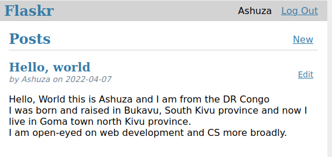
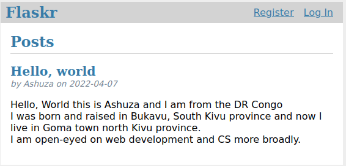
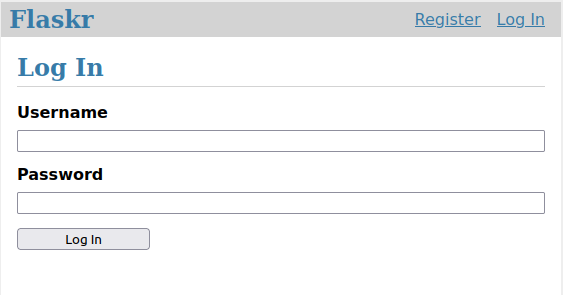

# Flaskr Blog

## This tutorial will walk you through creating a basic blog application called Flaskr. Users will be able to register, log in, create posts, and edit or delete their own posts. You will be able to package and install the application on other computers.

## Final Result 

### Home Page While being connected 

### Home page without being connected 

### Login Page 

**Find out the Tutorial [here](https://flask.palletsprojects.com/en/2.1.x/tutorial/) and dive in into python and flask.**